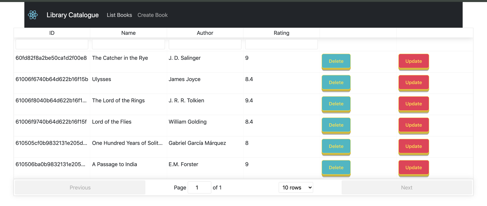

# library-booking-system

# Summary
A library catalogue system built using the MERN stack to have some of your favourite books and rate them too.

## Links to GitHub Repository (Main Branch)
GitHub Project Repository: https://github.com/naveen1994rai/library-booking-system

### To run the app
1. Clone the repo 
   1. Using https:
      `$ git clone https://github.com/naveen1994rai/library-booking-system.git`
   
   2. Using SSH:
      `$ git clone git@github.com:naveen1994rai/library-booking-system.git`

2. Install the application dependencies with :
  #### Server
    `$ cd library-booking-system/server`
    `$ npm i`
    `$ nodemon index.js`

  #### Client
    `$ cd library-booking-system/client`
    `$ npm i`
    `$ npm start`
  
3. Run the application :
  #### Server (Port 3000)
    `$ cd library-booking-system/server && nodemon index.js`

  #### Client (Port 8000)
    `$ cd library-booking-system/client && npm start`

  #### Database (Port 27017)
    Open a new terminal and run `$ mongod`

4. Access at http://localhost:8000 in your browser.

## Dependencies
   * React
   * React Tables
   * Axios
   * Express
   * Mongodb
   * Node.js

